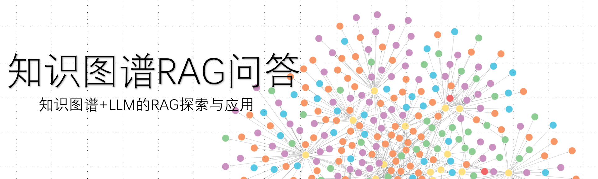
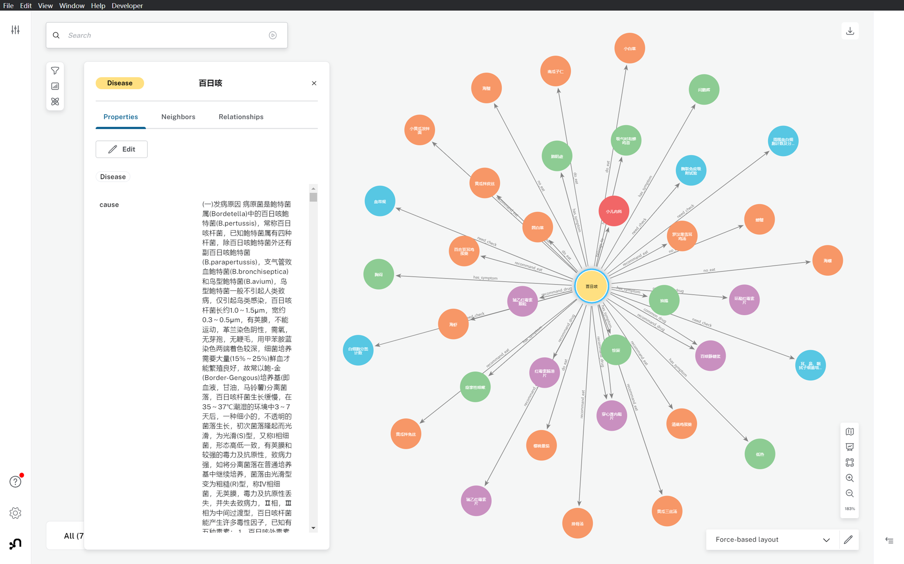
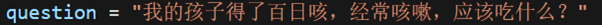
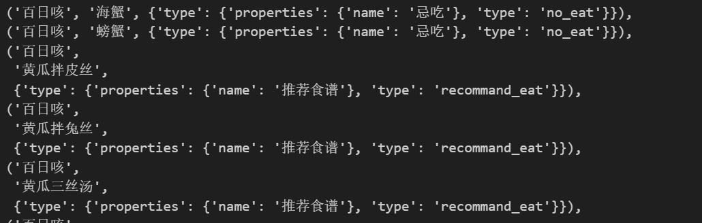
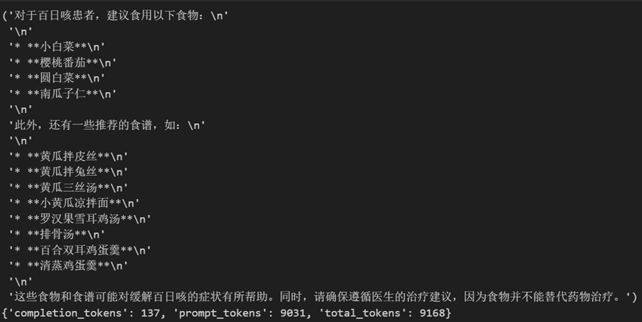
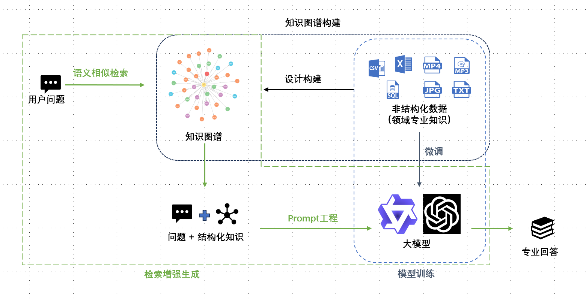
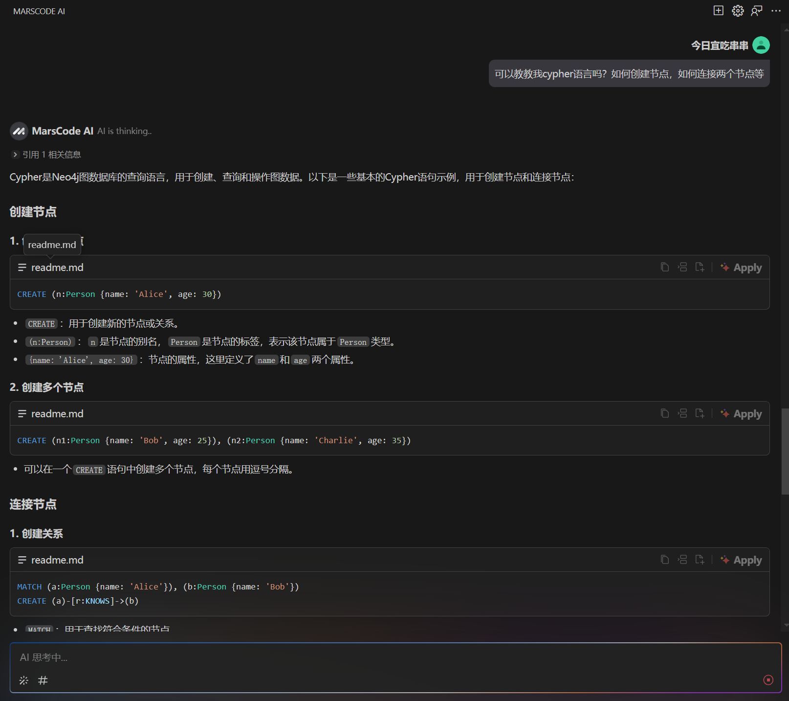
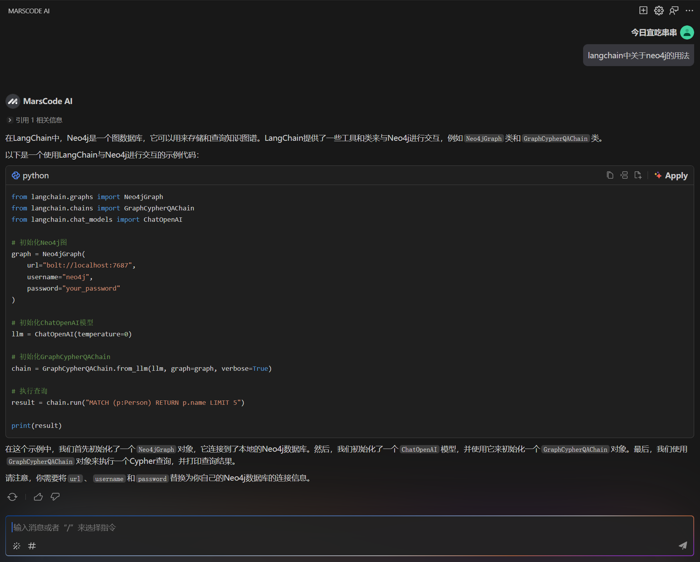
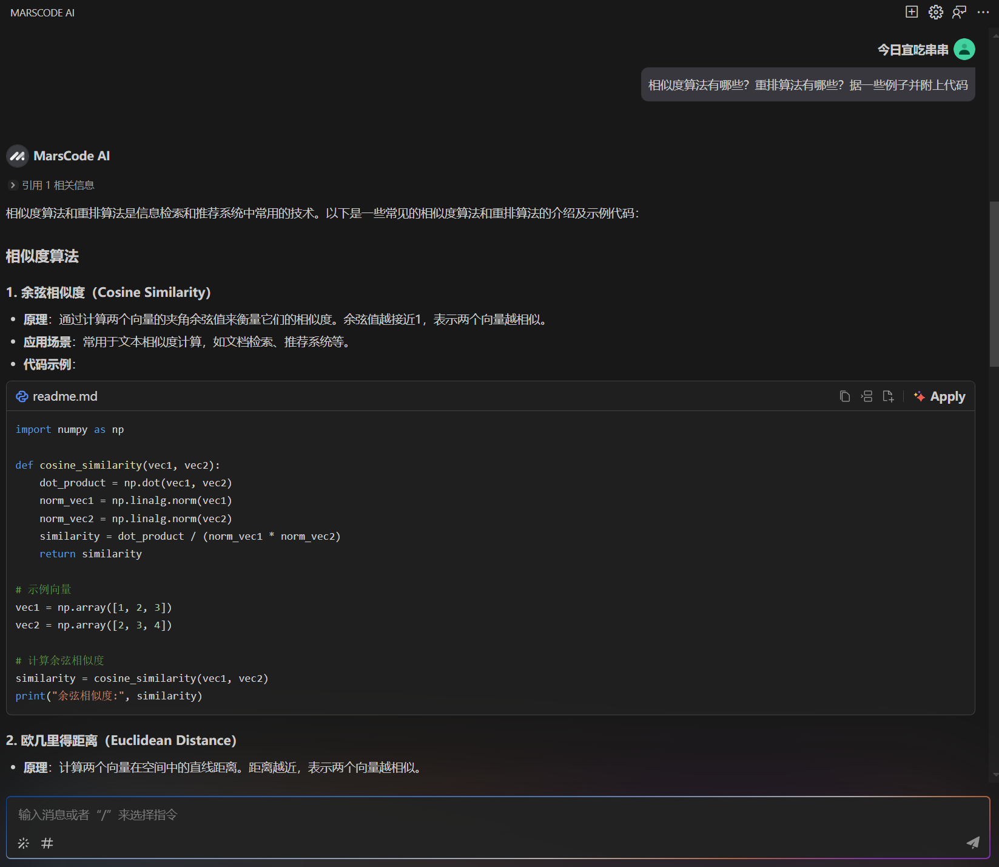

# Datawhale X MarsCode

## 知识图谱、RAG是什么？？？

**知识图谱**（Knowledge Graph）是一种用于表示和组织知识的图形化表示方法。它由**节点**（Entities）和**边**（Relationships）组成，用于表示实体之间的**关系**。知识图谱可以用于各种应用，例如信息检索、问答系统、推荐系统等。

**RAG**（Retrieval-Augmented Generation）是一种基于检索增强生成的技术，它通过**检索**相关的知来**增强**LLM的能力。RAG的核心思想是将LLM与外部知识源进行融合，以提高LLM的**生成能力**。

## 目录

- [项目背景](#项目背景)
- [Demo展示](#demo展示)
- [应用价值](#应用价值)
- [技术实现](#技术实现)
- [AI协作](#ai协作)
- [团队介绍](#团队介绍)

## 项目背景

近年来，大模型（LLM）在各个领域取得了许多重大成果。但是大模型有时会有答非所问的情况（幻觉），RAG能够缓解幻觉问题。然而基于文档RAG难以保持如医疗领域、汽车领域、农业领域专业知识具有的自身结构性。为了解决以上问题，提出了一种新的知识增强方法。该方法由**知识图谱**和**RAG**结合prompt工程组成**GRAG**框架。

## Demo展示

以医疗领域为例构建的知识图谱

用户提问

检索知识图谱

模型回答

## 应用价值

- 医疗疾病药物关系问答
- 刑侦人物关系推理
- 社交网络推荐系统

## 技术实现

## AI协作

### 知识图谱构建

使用MarsCode辅助编写爬虫脚本获取数据，再结合AI辅助构建知识图谱。利用MarsCode编写cypher语句将构建的知识图谱保存到Neo4j中进行[可视化展示](./img/image_dw_2.png)。

### RAG框架

使用到langchain、torch、transformers等库进行RAG框架的搭建，其中的用法借助MarsCode进行解释和编写样例参考。同时AI辅助编写一些相关算法如相似度算法、重排算法等，算法细节也能使用AI辅助进行学习和优化。

### 后续idea

借助MarsCode进行网站开发，实现用户提问、知识图谱检索、模型回答以及图谱可视化等功能。

## 团队介绍

10班-专业助教-周亮

- 信计专业 - 大四在读
- 相关经验 - 算法实习生
- 联系方式 - 我在10班学习群上，有感兴趣的小伙伴欢迎随时打扰！
